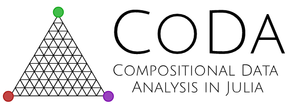

<p align="center">
  <br>
  <a href="https://github.com/JuliaEarth/CoDa.jl/actions">
    
  </a>
  <a href="https://codecov.io/gh/JuliaEarth/CoDa.jl">
    
  </a>
  <a href="LICENSE">
    
  </a>
</p>

This package defines a `Composition{D}` type representing a D-part composition as defined by
[Aitchison 1986](https://www.jstor.org/stable/pdf/2345821.pdf). In Aitchison's geometry,
the D-simplex together with addition (a.k.a. pertubation) and scalar multiplication
(a.k.a. scaling) form a vector space, and important properties hold:

- Scaling invariance
- Pertubation invariance
- Permutation invariance
- Subcompositional coherence

In practice, this means that one can operate on compositional data (i.e.  vectors whose
entries represent parts of a total) without destroying the ratios of the parts.

## Installation

Get the latest stable release with Julia's package manager:

```julia
] add CoDa
```

## Usage

### Basics

Compositions are static vectors with named parts:

```julia
julia> using CoDa

julia> c = Composition(CO₂=2.0, CH₄=0.1, N₂O=0.3)
    ┌                                         ┐
CO₂ ┤■■■■■■■■■■■■■■■■■■■■■■■■■■■■■■■■ 2.000000
CH₄ ┤■■                               0.100000
N₂O ┤■■■■■                            0.300000
    └                                         ┘

julia> CoDa.parts(c)
(:CO₂, :CH₄, :N₂O)

julia> CoDa.components(c)
3-element StaticArrays.SVector{3, Union{Missing, Float64}} with indices SOneTo(3):
 2.0
 0.1
 0.3

julia> c.CO₂
2.0
```

Default names are added otherwise:

```julia
julia> c = Composition(1.0, 0.1, 0.1)
   ┌                                         ┐
w1 ┤■■■■■■■■■■■■■■■■■■■■■■■■■■■■■■■■ 1.000000
w2 ┤■■■                              0.100000
w3 ┤■■■                              0.100000
   └                                         ┘
```

and serve for internal compile-time checks.

Compositions can be added, subtracted, negated, and multiplied by
scalars. Other operations are also defined including dot product,
induced norm, and distance:

```julia
julia> c = Composition(CO₂=2.0, CH₄=0.1, N₂O=0.3)
    ┌                                         ┐
CO₂ ┤■■■■■■■■■■■■■■■■■■■■■■■■■■■■■■■■ 2.000000
CH₄ ┤■■                               0.100000
N₂O ┤■■■■■                            0.300000
    └                                         ┘

julia> cₒ = Composition(CO₂=1.0, CH₄=0.1, N₂O=0.1)
    ┌                                         ┐
CO₂ ┤■■■■■■■■■■■■■■■■■■■■■■■■■■■■■■■■ 1.000000
CH₄ ┤■■■                              0.100000
N₂O ┤■■■                              0.100000
    └                                         ┘

julia> -cₒ
    ┌                                         ┐
CO₂ ┤■■■                              0.047619
CH₄ ┤■■■■■■■■■■■■■■■■■■■■■■■■■■■■■■■■ 0.476190
N₂O ┤■■■■■■■■■■■■■■■■■■■■■■■■■■■■■■■■ 0.476190
    └                                         ┘

julia> 0.5c
    ┌                                         ┐
CO₂ ┤■■■■■■■■■■■■■■■■■■■■■■■■■■■■■■■■ 0.620769
CH₄ ┤■■■■■■■                          0.138808
N₂O ┤■■■■■■■■■■■■                     0.240423
    └                                         ┘

julia> c - cₒ
    ┌                                         ┐
CO₂ ┤■■■■■■■■■■■■■■■■■■■■■            0.333333
CH₄ ┤■■■■■■■■■■■                      0.166667
N₂O ┤■■■■■■■■■■■■■■■■■■■■■■■■■■■■■■■■ 0.500000
    └                                         ┘

julia> c ⋅ cₒ
3.7554028908352994

julia> norm(c)
2.1432393747688687

julia> aitchison(c, cₒ) # Aitchison distance
0.7856640352007868
```

More complex functions can be defined in terms of these
operations. For example, the function below defines the
composition line passing through `cₒ` in the direction of `c`:

```julia
julia> f(λ) = cₒ + λ*c
f (generic function with 1 method)
```

Finally, two compositions are considered to be equal when
their closure is approximately equal:

```julia
julia> c == c
true

julia> c == cₒ
false
```

### Log-ratio transformations

Currently, the following log-ratio transformations are implemented:

```julia
julia> alr(c)
2-element StaticArraysCore.SVector{2, Float64} with indices SOneTo(2):
  1.8971199848858806
 -1.098612288668108

julia> clr(c)
3-element StaticArraysCore.SVector{3, Float64} with indices SOneTo(3):
  1.6309507528132896
 -1.3647815207406992
 -0.26616923207259097

julia> ilr(c)
2-element StaticArraysCore.SVector{2, Float64} with indices SOneTo(2):
 -2.1183026052494185
 -0.3259894019031434
```

and their inverses `alrinv`, `clrinv` and `ilrinv`.

The transforms for tables are defined in the [TableTransforms.jl](https://github.com/JuliaML/TableTransforms.jl)
package, they are: `Compose`, `Closure`, `Remainder`, `ALR`, `CLR`, `ILR`.
These transforms are functors that can be used as follows:

```julia
julia> table |> ILR()
```

### Arrays

It is often useful to compose `D` columns of a table into `D`-part compositions. The
package provides a `CoDaArray` type that implements the Julia array interface *and* the
Tables.jl interface. We recommend using the function `compose(table, cols)` to construct
such arrays:

```julia
julia> table = (a=[1,2,3], b=[4,5,6], c=[7,8,9])
(a = [1, 2, 3], b = [4, 5, 6], c = [7, 8, 9])

julia> ctable = compose(table, (:a,:b))
(c = [7, 8, 9], coda = Composition{2, (:a, :b)}[1.000 : 4.000, 2.000 : 5.000, 3.000 : 6.000])

julia> ctable.coda[1]
  ┌                                         ┐
a ┤■■■■■■■■                         1.000000
b ┤■■■■■■■■■■■■■■■■■■■■■■■■■■■■■■■■ 4.000000
  └                                         ┘
```

### Random

`D`-part compositions can be created at random from a Dirichlet distribution:

```julia
julia> rand(Composition{3})
   ┌                                         ┐
w1 ┤■■■■■■■■■■■■■■■■■■■■■■■■■■■■■■■■ 0.508093
w2 ┤■■■■■■■■■■■■                     0.183344
w3 ┤■■■■■■■■■■■■■■■■■■■              0.308563
   └                                         ┘
```

### Plots

Separate packages are available for plotting compositional data:

- Relative variation biplots: [Biplots.jl](https://github.com/MakieOrg/Biplots.jl)
- Ternary diagrams (Makie.jl) [TernaryDiagrams.jl](https://github.com/stelmo/TernaryDiagrams.jl)
- Ternary diagrams (Plots.jl) [TernaryPlots.jl](https://github.com/jacobusmmsmit/TernaryPlots.jl)

## References

This package is heavily influenced by Aitchison's monograph:

- Aitchison, J. 1986. *The Statistical Analysis of Compositional Data*

and by other textbooks:

- den Boogaart, K. & Tolosana-Delgado. 2011. *Analyzing Compositional Data with R*
- Pawlowsky-Glahn et al. 2015. *Modeling and Analysis of Compositional Data*
- Pawlowsky-Glahn, V. & Buccianti, A. 2011. *Compositional Data Analysis - Theory and Applications*
